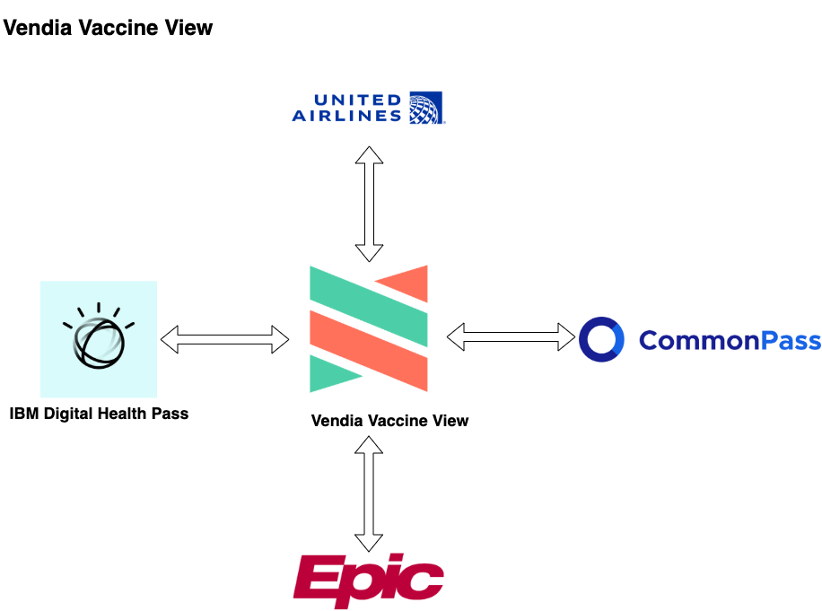
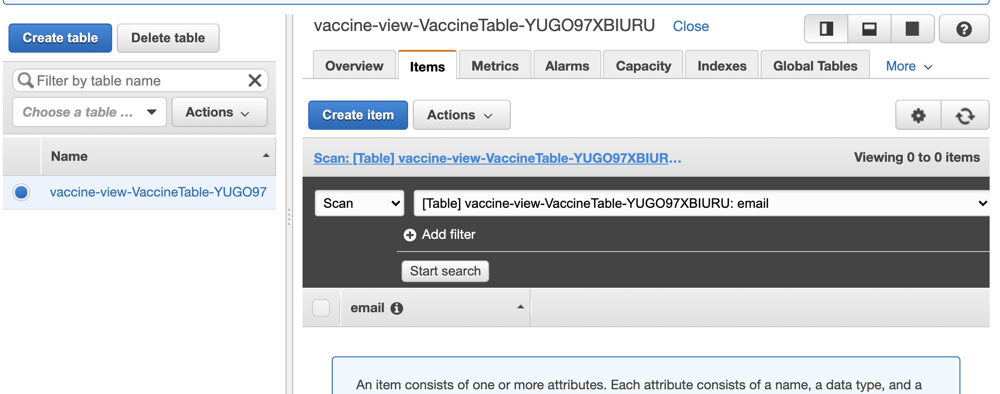
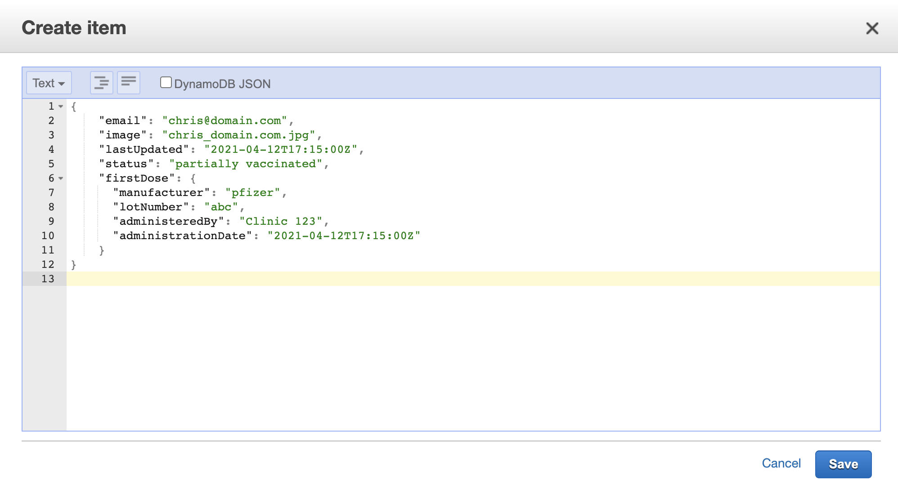
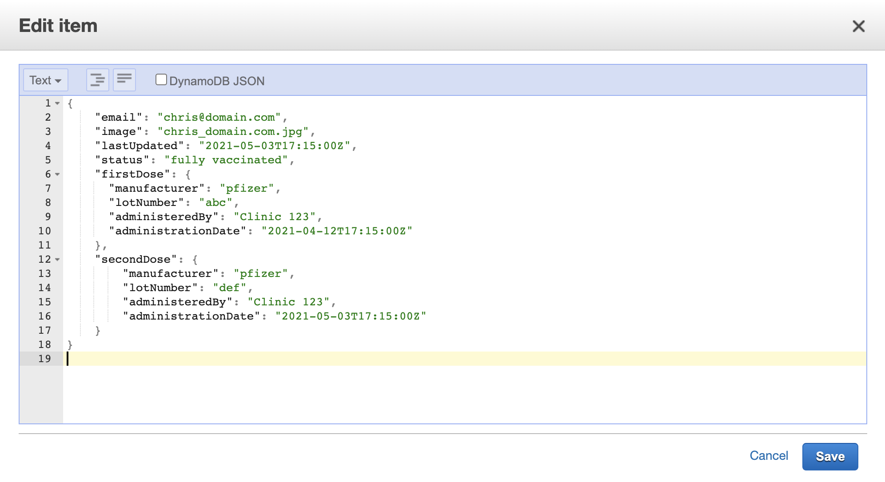
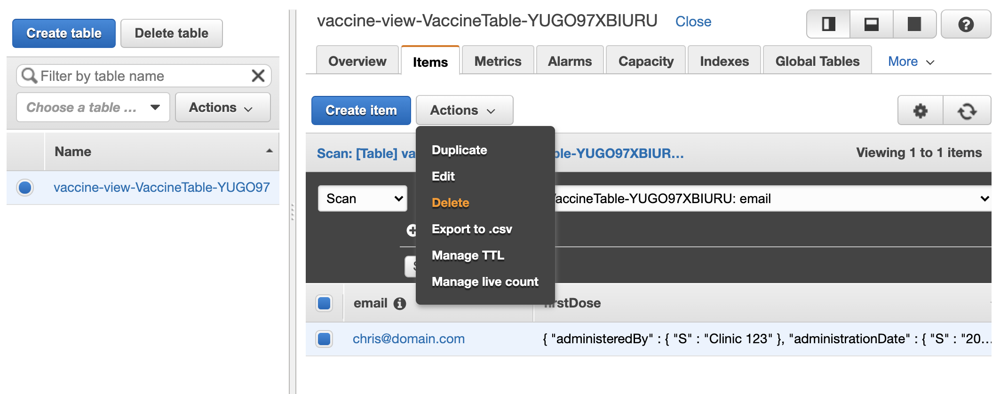

# Vendia Vaccine View

This example will demonstrate how Vendia Share can be used to allow vaccine data to be shared among passport services (eg IBM Digital Health Pass, CommonPass) and electronic health records.  The intent behind storing common data used by disparate parties is to reduce the additional burden people might face in being required to use different passport software.




# Pre-requisites

* [Python3](https://www.python.org/download)

* [AWS Serverless Application Model CLI](https://docs.aws.amazon.com/serverless-application-model/latest/developerguide/serverless-sam-cli-install.html)

* [AWS CLI version 2](https://docs.aws.amazon.com/cli/latest/userguide/install-cliv2.html)

* [Docker](https://docs.docker.com/install/)

* [Vendia Share CLI](https://vendia.net/docs/share/cli)


## Installing Python3 Dependencies

```bash
python3 -m venv venv
. venv/bin/activate
pip install pip --upgrade
pip install -r requirements.txt
```


## Clone the Repository

In order to use this example, you'll first need to clone the respository.


### Clone with SSH

```bash
git clone git@github.com:brian-vendia/vaccine-view.git
```


### Clone with HTTPS

```bash
git clone https://github.com/brian-vendia/vaccine-view.git
```

# Deploying the Example Uni

This example will create a Uni comprised of nodes representing [United Airlines](https://www.united.com), [Epic](https://www.epic.com/), [IBM Digital Health Pass](https://www.ibm.com/products/digital-health-pass), and [CommonPass](https://commonpass.org/).

If you are not already logged in to the share service you do so by running [`share login`](https://vendia.net/docs/share/cli/commands/login):

```bash
share login
```

The `share uni create` command can be used to deploy our uni.  You will need to copy the file `registration.json.sample` to `registration.json`.  Pick a unique `name` for your uni that begins with `test-` - by default all unis share a common namespace so here is your chance to get creative.  Update the `userId` attribute of each node to reflect your Vendia Share email address.

```bash
cd uni_configuration
share uni create --config registration.json
```

The uni will take approximately 5 minutes to deploy.  We can check on its status in the Vendia Share web application or with the `share` CLI.

**NOTE:** The name of your Uni may be different.  Adjust as appropriate.

```bash
share get --uni test-vendia-vaccine-view
```

# The Sample Application

The sample application will simulate an ambulatory EHR (like [Epic](https://www.epic.com/)) uploading a patient's vaccine record card to their own AWS S3 bucket.  This, in turn, will trigger an upload of that image to Epic's Vendia node.  Once the image is in the Epic node it will be available to the other participants as well.


## Build

```bash
cd .. # If you're not already in the root of the vaccine-view directory
sam build --use-container
```

## Deploy

Please run the following command for the first deployment of the application.

```bash
sam deploy --guided
```

Enter **vaccine-view** as the stack name.  Specify the same AWS region as **EpicEhr**.  You will be prompted to enter data for the *ShareNodeUrl* and *ShareNodeApiKey*.  Please use the values from the **EpicEhr** Vendia Share node.  You will also be prompted to enter the account ID of your **EpicEhr** node.  This is done to set up the necessary trust relationship for the upload to work.

Subsequent deployments can use the command `sam deploy`.  The values stored in *samconfig.toml* will be used.

Several resources will be created as a part of the CloudFormation Stack:

* S3 bucket **InputBucket** will house images of vaccine cards

* DynamoDB table **VaccineTable** will store data about the vaccination

* Lambda function **FileDataFunction** will process files uploaded to **InputBucket** and put them in the Vendia Uni

* Lambda function **ScalarDataFunction** will process data that is added, updated, or deleted in **VaccineTable** and modify the accompanying data in the Vendia Uni

The S3 URL of the **InputBucket** will be printed out when the CloudFormation Stack is successfully deployed.

# Testing the Sample Application

## Test File Upload Capability

Upload the [sample vaccination report card](./sample_data/chris_domain.com.jpg) to the S3 bucket defined in the CloudFormation Stack outputs.

```bash
# This is a sample command - your S3 bucket URL will be different
aws s3 cp ./sample_data/chris_domain.com.jpg s3://vaccine-view-123456789012-input-bucket
```

This will trigger the **FileDataFunction** function to fire, ultimately copying the data to your Vendia Share Uni.  You can run the following GraphQL query rom the GraphQL Explorer of any node in the Uni.

```graphql
query listFiles {
  list_Files {
    _Files {
      id
      SourceBucket
      SourceKey
      SourceRegion
      DestinationKey
      CreatedAt
    }
  }
}
```

## Test Working with Scalar Data

We will work through the process of creating, updating, and deleting records in DynamoDB to illustrate a technique for keeping data in sync with the Vendia Share Uni.

### Creating a New Record

In this scenario, Chris, a patient at an Epic clinic, has received the first vaccine shot.  This data will be recorded in the DynamoDB table.  From the AWS Console, click on the `New Item` button and enter the contents of the file `sample_data/sample_ddb_partial.json` as *Text*.  This should create a new entry for the patient associated with the email address `chris@domain.com`.  A corresponding entry should be created in the Vendia Share Uni.  Run the following command from the GraphQL Explorer to confirm the record created in DynamoDB has been added to your Vendia Share Uni.





**NOTE:** It may take several seconds for the query below to return a value.  This is expected as a part of the consensus operation.

```graphql
query listVaccineRecord {
  listVaccineRecords(
    filter: {
      email: {
        eq: "chris@domain.com"
      }
    }
  ) {
    VaccineRecords {
      id
      email
      image
      status
      lastUpdated
      firstDose {
        manufacturer
        lotNumber
        administeredBy
        administrationDate
      }
      secondDose {
        manufacturer
        lotNumber
        administeredBy
        administrationDate
      }
    }
  }
}
```

### Updating a Record

Let's go ahead an record Chris' second vaccine shot.  We will click on the DynamoDB record for `chris@domain.com` and enter the contents of the file `sample_data/sample_ddb_full.json` as *Text*.  This will update the existing record for our user `chris@domain.com` to include data about the second shot.  The existing record for Chris will be updated in the Vendia Share Uni.  Run the following command from the GraphQL Explorer to confirm the updated record in DynamoDB has been updated in your Vendia Share Uni.



**NOTE:** It may take several seconds for the query below to return a value.  This is expected as a part of the consensus operation.

```graphql
query listVaccineRecord {
  listVaccineRecords(
    filter: {
      email: {
        eq: "chris@domain.com"
      }
    }
  ) {
    VaccineRecords {
      id
      email
      image
      status
      lastUpdated
      firstDose {
        manufacturer
        lotNumber
        administeredBy
        administrationDate
      }
      secondDose {
        manufacturer
        lotNumber
        administeredBy
        administrationDate
      }
    }
  }
}
```

The details of the `secondDose` should be reflected in the Vendia Share Uni.

### Deleting a Record

Let's go ahead an remove Chris' vaccine record.  We will click on the checkbox of Chris' DynamoDB record and select the Delete option of the Actions button.  This will remove the record from DynamoDB as well as the Vendia Share Uni.  Run the following command from the GraphQL Explorer to confirm there is no record of `chris@domain.com` in your Vendia Share Uni.



**NOTE:** It may take several seconds for the query below to return a value.  This is expected as a part of the consensus operation.

```graphql
query listVaccineRecord {
  listVaccineRecords(
    filter: {
      email: {
        eq: "chris@domain.com"
      }
    }
  ) {
    VaccineRecords {
      id
      email
      image
      status
      lastUpdated
      firstDose {
        manufacturer
        lotNumber
        administeredBy
        administrationDate
      }
      secondDose {
        manufacturer
        lotNumber
        administeredBy
        administrationDate
      }
    }
  }
}
```

The record for `chris@domain.com` will be remove from DynamoDB _and_ the Vendia Share Uni.
